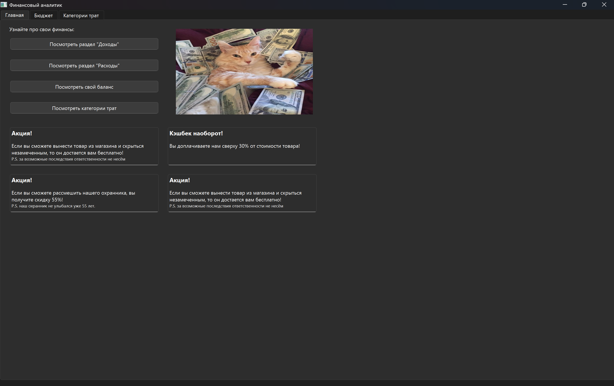
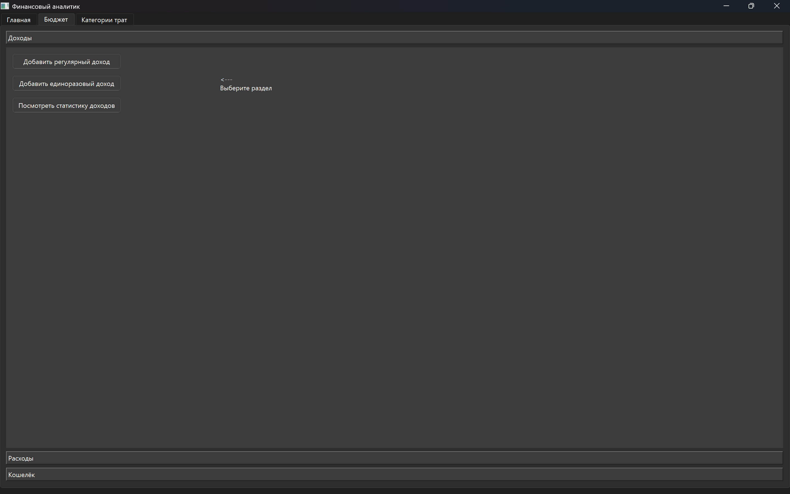
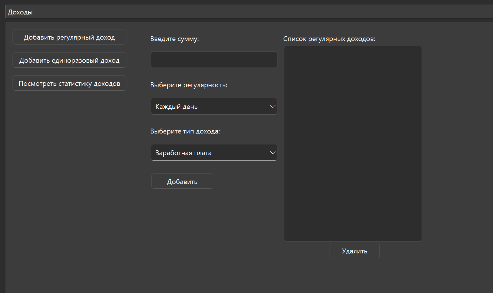
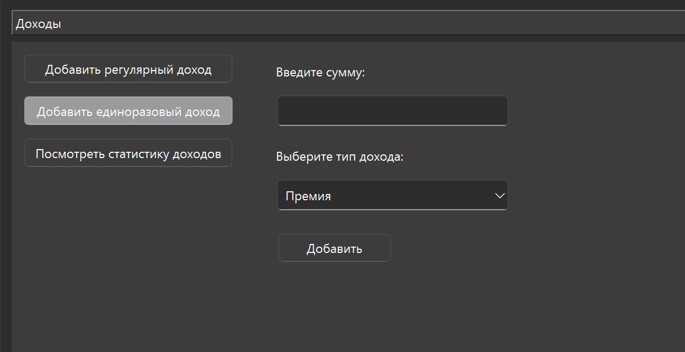
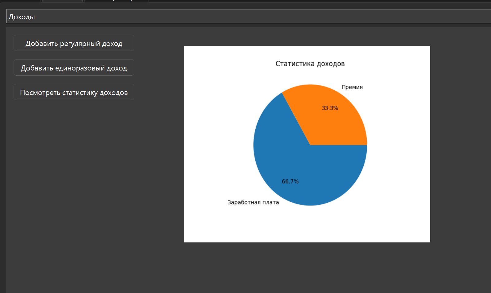
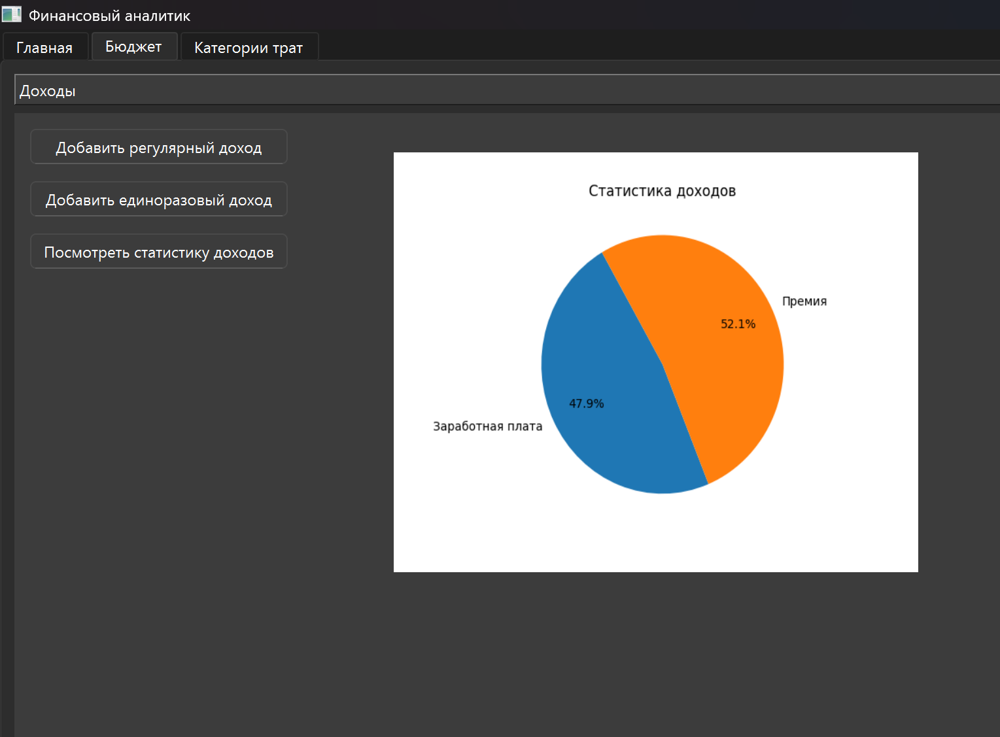
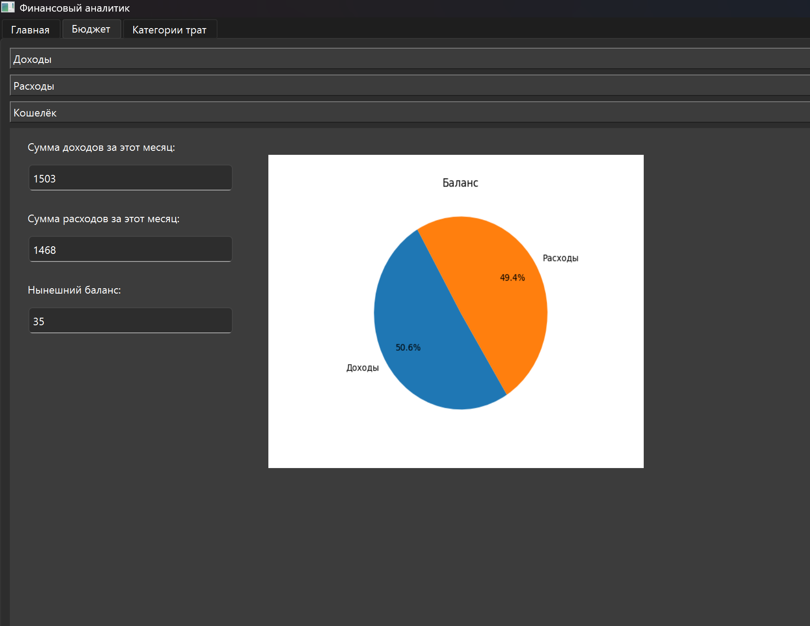

# Персональный финансовый аналитик
## Общее описание
Моя программа "Персональный финансовый аналитик" будет представлять собой инструмент для управления бюджетом пользователя. Она включает в себя учёт доходов и расходов, контроль бюджета, категоризацию трат.
## Функционал
### Возможности программы:
1. Добавление регулярных доходов и расходов, их автоматический учёт в бюджете
2. Добавление единоразовых доходов и расходов
3. Возможность просмотра категорий трат за настоящий период
4. Возможность просмотра бюджета на данный момент, трат за настоящий период
## Техническое задание
Мой проект будет выглядеть следующим образом:
Первая страница "Главная" является основной, открывающейся по умолчанию. На ней будут размещены кнопки, переводящие пользователя на определенные разделы. Вверху будут реализованы другие способы перемещения между разделами.
Вторая страница "Бюджет", где будут разделы "Доходы", "Расходы" и "Кошелёк". В первых двух будут возможности добавления доходов/расходов, в третьем - просмотр баланса.
Третья страница "Категории трат", где можно будет посмотреть траты за месяц и в какой категории сколько было потрачено.
При введении нулевых сумм или попытке продолжить без выбора из выпадающего списка, в строке состояния будет выводиться сообщение об ошибке.
## Пояснительная записка
Для установки всех нужных библиотек введите следующую команду в терминал:
```shell
pip install -r requirements.txt
```
При запуске моей программы, при нахождении подходящей по структуре базы данных, высвечивается QMessageBox, спрашивающий, нужно ли загружать найденную базу данных. Если такой не найдено, то автоматически создается нужная база данных. Далее отокрывается главная страница.

На ней расположены кнопки перемещения во все отделы(доходы, расходы, баланс, категории трат). Сверху расположены вкладки - другой метод перемещения.
При переходе во вкладку Доходы, открывается следующая страница.

На ней расположены кнопки добавления регулярных и единоразовых доходов, а также просмотра статистики доходов. Каждая из них открывает новую страницу QStackedWidget.

При открытии следующей страницы QToolBox "Расходы", все выглядит также, как и с доходами.
При открытии страницы "Кошелёк" высвечиваются доходы, расходы, общий баланс пользователя и статистика доходов и расходов.

При открытии страницы QTabWidget "Категории трат", высвечивается список категорий всех трат и их статистика.

Все данные хранятся в базе данных, в нескольких таблицах.